# Documento 2: Arquitetura de Alto Nível (C4 Model)

**Arquivo:** `design/2_arquitetura_alto_nivel.md`

**Propósito:** Descrever a estrutura técnica do sistema em diferentes níveis de abstração. Este documento serve como um mapa para os desenvolvedores entenderem as fronteiras, responsabilidades e tecnologias de cada componente principal do software.

**Público-alvo:** Time de Desenvolvimento (Frontend e Backend).

---

### 1. Nível 1: Diagrama de Contexto de Sistema

Este diagrama posiciona nosso sistema no centro e mostra como ele interage com os usuários e os sistemas externos dos quais depende.


**Principais Interações Externas:**
-   **Usuários (Colaborador, Guardião):** Interagem com o sistema exclusivamente via HTTPS através de um navegador web.
-   **Google AI Platform:** O sistema depende do Google para duas funções críticas:
    1.  **Geração de Embeddings:** Para transformar os `Artifact Chunks` e `Learnings` em vetores.
    2.  **Geração de Linguagem (LLM):** Para criar o `Conselho Cultural` com base no prompt enriquecido (RAG).
-   **Supabase:** Funciona como a espinha dorsal de persistência do sistema, fornecendo banco de dados, armazenamento de arquivos e capacidade de busca vetorial.

---

### 2. Nível 2: Diagrama de Contêineres

Este diagrama "dá um zoom" no `Sistema Agente Cultural de IA`, mostrando os principais blocos de tecnologia que o compõem. Cada caixa representa uma unidade implantável ou um sistema de dados distinto.

```mermaid
graph TD
    subgraph "Sistema Agente Cultural de IA (Seus Contêineres)"
        direction TB
        frontend_app("💻<br><b>Frontend App (SPA)</b><br>[React, TypeScript, shadcn/ui]<br><br>Renderiza a UI de chat e o painel de admin.<br>Responsável por todo o estado da UI e pela comunicação com a API Backend.")
        backend_api("🐍<br><b>Backend API</b><br>[Python, FastAPI]<br><br>Expõe a API REST, orquestra a lógica de domínio,<br>processa arquivos, gerencia o RAG e se comunica com os serviços externos.")
        
        subgraph "☁️ Supabase"
            direction TB
            db("🗄️<br><b>Banco de Dados</b><br>[PostgreSQL com extensão pgvector]<br><br>Armazena dados estruturados: artefatos, chunks, embeddings, conversas, feedbacks, aprendizados.")
            storage("📦<br><b>File Storage</b><br>[Supabase Storage]<br><br>Armazena os arquivos PDF originais enviados pelos Guardiões Culturais.")
        end
    end

    colaborador("👤<br>Colaborador") -- "Usa via Browser<br>[HTTPS]" --> frontend_app
    guardiao("👤<br>Guardião Cultural") -- "Usa via Browser<br>[HTTPS]" --> frontend_app
    
    frontend_app -- "Faz chamadas à API<br>[HTTPS/JSON]" --> backend_api
    
    backend_api -- "Executa queries SQL e busca vetorial<br>[PostgreSQL Protocol]" --> db
    backend_api -- "Upload/Download de arquivos<br>[Supabase Storage API]" --> storage
    backend_api -- "Envia prompts e recebe completudes<br>[HTTPS/JSON]" --> gemini("☁️<br>Google AI Platform<br>[Gemini API]")

    style frontend_app fill:#87CEEB
    style backend_api fill:#32CD32
    style db fill:#FFD700
    style storage fill:#F0E68C
```



#### **Detalhes e Fluxos de Dados Principais:**

1.  **Fluxo de Ingestão de Artefato (PDF):**
    1.  `Guardião` faz upload de um PDF na `Frontend App`.
    2.  `Frontend App` envia o arquivo (via `multipart/form-data`) para um endpoint na `Backend API`.
    3.  `Backend API` recebe o arquivo, extrai seu texto, divide-o em `chunks`.
    4.  Para cada `chunk`, a `Backend API` chama a API do `Google Gemini` para obter um `embedding` (vetor).
    5.  `Backend API` salva o arquivo original no `Supabase Storage`.
    6.  `Backend API` salva os metadados do artefato e cada `chunk` com seu respectivo `embedding` no banco de dados `PostgreSQL`.

2.  **Fluxo de Conversa (Chat):**
    1.  `Colaborador` envia uma nova mensagem na `Frontend App`.
    2.  `Frontend App` envia a mensagem e o `conversation_id` para a `Backend API`.
    3.  `Backend API` gera um `embedding` para a mensagem do usuário.
    4.  `Backend API` usa esse `embedding` para fazer uma busca de similaridade (busca vetorial) nas tabelas `artifact_chunks` e `learnings` do `PostgreSQL` para encontrar o contexto relevante.
    5.  `Backend API` constrói o prompt final (com Instrução Geral, histórico, contexto RAG e nova mensagem) e o envia para a `API do Gemini`.
    6.  `Backend API` recebe a resposta, persiste as novas mensagens (usuário e agente) no `PostgreSQL` e retorna a resposta do agente para a `Frontend App`.
    7.  `Frontend App` renderiza a nova mensagem na UI.

#### **Tecnologias e Decisões de Arquitetura (MVP):**

-   **Frontend:**
    -   **Framework:** React com Vite para um setup rápido e moderno.
    -   **Linguagem:** TypeScript para segurança de tipos, espelhando a abordagem do backend.
    -   **UI:** `shadcn/ui` para componentes de alta qualidade e acessíveis.
    -   **Gerenciamento de Estado:** Zustand ou React Query para gerenciar o estado da UI e as chamadas à API.

-   **Backend:**
    -   **Framework:** FastAPI pela sua performance, suporte nativo a `async` e documentação automática de API (OpenAPI).
    -   **Linguagem:** Python. O código seguirá um estilo "funcional imperativo": a lógica de domínio será escrita em funções puras com tipos explícitos (`dataclasses`), enquanto as "bordas" da aplicação (endpoints, acesso ao DB) lidarão com o I/O e efeitos colaterais.
    -   **Processamento de PDF:** `PyMuPDF` pela sua eficiência.
    -   **Acesso ao Supabase:** Biblioteca `supabase-py` para interagir com o Storage e `psycopg3` para uma interação mais controlada com o PostgreSQL e `pgvector`.

-   **Supabase:**
    -   Escolhido por ser uma solução "Backend-as-a-Service" que integra PostgreSQL, Storage, e extensões como `pgvector` em uma única plataforma, simplificando drasticamente a infraestrutura para o MVP.

---

### 3. Estrutura do Código (Proposta Inicial)

Para garantir o alinhamento com a arquitetura, a estrutura de pastas do projeto pode seguir este modelo:

```
/
├── frontend/         # Aplicação React
│   ├── src/
│   │   ├── components/ # Componentes Shadcn/UI customizados
│   │   ├── views/      # Telas principais (ChatView, AdminView)
│   │   ├── services/   # Lógica de chamada à API
│   │   └── state/      # Gerenciamento de estado (Zustand/React Query)
│
├── backend/          # Aplicação Python/FastAPI
│   ├── app/
│   │   ├── api/        # Módulos dos endpoints (routers do FastAPI)
│   │   │   ├── routes/ # Routers por domínio (artifacts, conversations, feedbacks, learnings, agent)
│   │   │   └── dto.py  # Data Transfer Objects (Pydantic models)
│   │   ├── domain/     # Lógica de negócio pura, tipos e workflows
│   │   │   ├── artifacts/
│   │   │   ├── conversations/
│   │   │   ├── feedbacks/
│   │   │   ├── learnings/
│   │   │   ├── agent/
│   │   │   └── shared_kernel.py
│   │   ├── infrastructure/ # Implementações de I/O (repositórios do Supabase, cliente do Gemini)
│   │   │   ├── persistence/ # Repositórios (artifacts, conversations, feedbacks, learnings)
│   │   │   ├── ai/      # Serviços de IA (Gemini, Embeddings)
│   │   │   └── files/   # Processamento de arquivos (PDF)
│   │   └── main.py     # Ponto de entrada da aplicação FastAPI
│
└── design/           # Documentos de design (esta pasta)
    ├── 1_visao_geral_dominio.md
    ├── 2_arquitetura_alto_nivel.md
    └── ...
```

Este documento fornece a base técnica para que os desenvolvedores entendam "onde" cada pedaço de código vive e "como" as partes se falam. O próximo passo é detalhar o "o quê" dessa comunicação.